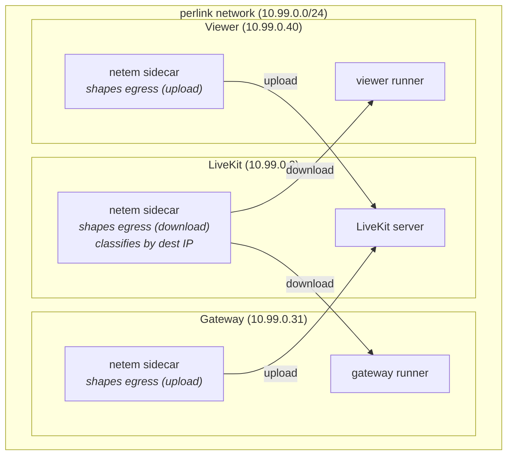

# Network impairment testing

Simulate degraded network conditions between the SDK gateway, LiveKit, and the Foxglove app viewer. Each link can be impaired independently to model real-world asymmetric networks.

## Architecture



**Traffic flow (gateway example):**
- gateway → LiveKit: runner sends, passes through gateway netem sidecar egress (upload shaping)
- LiveKit → gateway: LiveKit sends, passes through LiveKit netem sidecar egress, classified to gateway class (download shaping)

## Quick start (flat mode)

Run the test card on the host with uniform impairment on all traffic:

```sh
# Terminal 1: start LiveKit + netem
yarn start-netem

# Terminal 2: start the Foxglove app (if not already running)
(cd ../app && docker compose up -d && yarn start)

# Terminal 3: start the web frontend
(cd ../app && yarn web serve:local)

# Terminal 4: run the test card
FOXGLOVE_API_URL=http://localhost:3000/api \
FOXGLOVE_DEVICE_TOKEN=fox_dt_... \
cargo run -p example_remote_access --release
```

Open `http://localhost:8080` in a browser and connect to the device.

## Quick start (per-link mode)

Run the test card inside a Docker container so each link gets independent
impairment. Requires the Foxglove app to return a LiveKit URL reachable
from both the browser and the container.

**Prerequisites (macOS):** Add `host.docker.internal` to `/etc/hosts` so the
browser can resolve it (Docker Desktop only resolves it inside containers):

```sh
sudo sh -c 'echo "127.0.0.1 host.docker.internal" >> /etc/hosts'
```

```sh
# Terminal 1: start LiveKit + netem with per-link sidecars
yarn start-netem --perlink

# Terminal 2: start the Foxglove app with LiveKit URL override
# host.docker.internal resolves to the host from both macOS and Docker containers.
(cd ../app && docker compose up -d && LIVEKIT_HOST=ws://host.docker.internal:7880 yarn start)

# Terminal 3: start the web frontend
(cd ../app && yarn web serve:local)

# Terminal 4: build and run the test card inside the gateway container
COMPOSE="docker compose -f docker-compose.yaml -f docker-compose.netem.yml -f docker-compose.netem-livekit.yml"
$COMPOSE exec gateway-runner cargo build -p example_remote_access --release
$COMPOSE exec \
  -e FOXGLOVE_API_URL=http://host.docker.internal:3000/api \
  -e FOXGLOVE_DEVICE_TOKEN=fox_dt_... \
  -e RUST_LOG=foxglove=debug,info \
  gateway-runner \
  /workspace/target-docker/release/example_remote_access
```

Open `http://localhost:8080` in a browser and connect to the device. The test
card traffic traverses the impaired gateway link (upload shaped by
`gateway-netem`, download shaped by the LiveKit netem sidecar's gateway class).

> **Note:** The first `cargo build` inside the container takes ~90 seconds.
> Subsequent builds are incremental (the target directory is cached in a Docker
> volume). Requires Docker Desktop with at least 12 GB of memory allocated.

## Default impairment profiles

When no NETEM_* environment (see Custom Impairment) variables are set, the impairment is:

| Link | Direction | Default | Simulates |
|------|-----------|---------|-----------|
| Gateway ↔ LiveKit | upload (gateway → LK) | delay 30ms 10ms loss 2% rate 15mbit | Device on Starlink |
| Gateway ↔ LiveKit | download (LK → gateway) | delay 30ms 10ms loss 2% rate 100mbit | Device on Starlink |
| Viewer ↔ LiveKit | upload (viewer → LK) | delay 5ms rate 100mbit | User on fiber |
| Viewer ↔ LiveKit | download (LK → viewer) | delay 5ms rate 500mbit | User on fiber |

## Custom impairment

You may choose to override any link direction with environment variables, for example:

```sh
# Asymmetric gateway: bad uploads, okay downloads
NETEM_GATEWAY_UPLOAD="delay 300ms 100ms loss 10%" \
NETEM_GATEWAY_DOWNLOAD="delay 50ms 10ms loss 1%" \
NETEM_VIEWER_UPLOAD="delay 5ms" \
NETEM_VIEWER_DOWNLOAD="delay 5ms" \
yarn start-netem --perlink
```

## Changing impairment live

Update impairment without restarting containers or dropping connections. Only newly enqueued packets use the updated parameters.

Each update replaces *all* settings. Replacing "delay 500ms loss 20%" with "delay 400ms" (loss is not mentioned) *resets* loss to 0%.

```sh
COMPOSE="docker compose -f docker-compose.yaml -f docker-compose.netem.yml -f docker-compose.netem-livekit.yml"

# Degrade the gateway upload link
$COMPOSE exec gateway-netem python3 /netem_impair.py delay 500ms loss 20%

# Reset gateway upload to pristine
$COMPOSE exec gateway-netem python3 /netem_impair.py delay 0ms

# Update ALL download links at once (changes every netem qdisc on the LiveKit sidecar)
$COMPOSE exec netem python3 /netem_impair.py delay 100ms loss 3%
```

> **Limitation:** Per-link download impairment cannot be updated independently
> with `netem_impair.py`. It updates all netem qdiscs at once. To change a
> single link's download, restart the stack with updated env vars.

## Replaying an MCAP under a shaped uplink

`yarn stream-mcap` replays a recording through a gateway program whose egress to
the SFU is shaped by netem — the common "device on a constrained uplink" case,
with no per-link network or relay. It uses `docker-compose.netem-egress.yml` — a
`runner` plus a `runner-netem` sidecar that shapes the runner's egress; the same
overlay shapes any gateway program you exec into it.

Point it at a deployed instance — its SFU's ICE candidates are publicly
routable, so a host browser can watch the device directly:

```sh
FOXGLOVE_DEVICE_TOKEN=fox_dt_... \
yarn stream-mcap /abs/path/to/heavy.mcap
```

`FOXGLOVE_API_URL` defaults to `https://api.foxglove.dev`; point it at another
instance to override. The device token must come from whichever instance you use,
for a device with remote access enabled in an org whose plan includes it. For a
local SFU, run the app and `--dev` LiveKit yourself and point `FOXGLOVE_API_URL`
at them.

The stack starts shaped at the `starlink` profile (the `NETEM_EGRESS` default).
Retune live without restarting — each call replaces all settings, and
`netem-impair` needs an explicit profile or raw args:

```sh
yarn netem-impair --profile severe     # delay 100ms 30ms loss 5% rate 2mbit
yarn netem-impair --profile pristine   # unshaped
yarn netem-impair -- delay 500ms loss 10%
```

Tear down with `docker compose -f docker-compose.netem-egress.yml down`.

## Scenarios

### Robot on Starlink, operator on fiber

Starlink (Ookla Q1 2026): median 31ms RTT, ~9ms jitter, 1-2% loss, 15 Mbps upload, 105 Mbps download. Periodic latency spikes every ~15s during satellite handovers (not modeled here).

```sh
NETEM_GATEWAY_UPLOAD="delay 30ms 10ms loss 2% rate 15mbit" \
NETEM_GATEWAY_DOWNLOAD="delay 30ms 10ms loss 2% rate 100mbit" \
NETEM_VIEWER_UPLOAD="delay 5ms rate 100mbit" \
NETEM_VIEWER_DOWNLOAD="delay 5ms rate 500mbit" \
yarn start-netem --perlink
```

### Robot on 4G, operator on hotel WiFi

4G (urban): 30-80ms RTT, 5-20ms jitter, 1-6% loss, 10-15 Mbps upload, 15-50 Mbps download. Hotel WiFi: highly variable, 20-80ms latency, 3-30 Mbps shared, bursty loss from congestion.

```sh
NETEM_GATEWAY_UPLOAD="delay 50ms 15ms loss 3% rate 10mbit" \
NETEM_GATEWAY_DOWNLOAD="delay 50ms 15ms loss 3% rate 30mbit" \
NETEM_VIEWER_UPLOAD="delay 40ms 20ms loss 2% rate 10mbit" \
NETEM_VIEWER_DOWNLOAD="delay 40ms 20ms loss 2% rate 20mbit" \
yarn start-netem --perlink
```

### Robot on WiFi through concrete walls

One concrete wall attenuates 15-25 dB at 2.4 GHz, causing 50-80% throughput reduction. Radio falls back to low modulation rates, causing high jitter from retransmissions and 5-10% loss at signal below -80 dBm.

```sh
NETEM_GATEWAY_UPLOAD="delay 15ms 10ms loss 8% rate 2mbit" \
NETEM_GATEWAY_DOWNLOAD="delay 15ms 10ms loss 8% rate 5mbit" \
NETEM_VIEWER_UPLOAD="delay 5ms rate 100mbit" \
NETEM_VIEWER_DOWNLOAD="delay 5ms rate 500mbit" \
yarn start-netem --perlink
```

### Pristine baseline (no impairment)

```sh
NETEM_GATEWAY_UPLOAD="delay 0ms" \
NETEM_GATEWAY_DOWNLOAD="delay 0ms" \
NETEM_VIEWER_UPLOAD="delay 0ms" \
NETEM_VIEWER_DOWNLOAD="delay 0ms" \
yarn start-netem --perlink
```

## Stopping

```sh
# Ctrl-C the yarn start-netem process, or:
docker compose -f docker-compose.yaml \
  -f docker-compose.netem.yml \
  -f docker-compose.netem-livekit.yml \
  --profile perlink down
```
